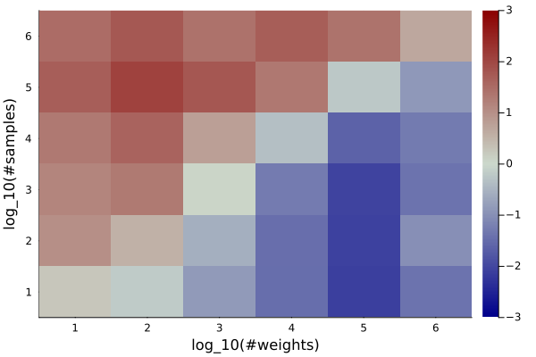

# Flexle benchmarking

Flexle.jl is a performance-focused package. Below are several benchmarks comparing the runtime of various
Flexle operations to their StatsBase.jl equivalents. See `test/test_runtime.jl` for code used to generate these graphs.

## Sampling

To assess raw sampling performance, we measured time to sample from a random weights vector (weights drawn
from a uniform distribution between 0 and 1) of size $10^k$ for $k \in [1 .. 6]$. Graphs show mean time in nanoseconds to perform a single
sample from a `Weights` object in the case of StatsBase or a `FlexleSampler` in that of Flexle. These numbers
include only sampling time, excluding time to compute the relevant data structure.

|  |
|:--:|
|*Figure 1: Comparison of raw sample runtime for `Flexle.sample` versus `StatsBase.sample`.* |

For larger weights vectors, Flexle far outperforms StatsBase in sampling time.
For smaller weights vectors, there is no substantial difference in runtime. Considering just sampling,
the performance benefits of using `Flexle.sample` versus `StatsBase.sample` are approximately linear in the number
of weights. (More precisely, for a collection of $n$ weights $W$\, `Flexle.sample` will run in $O(\log(d))$ time, where the
dynamic range $d = \frac{\max(W^+)}{\min(W^+)}$, the ratio between the largest and smallest nonzero weights. For common distributions
that are sufficiently large, $n$ so far exceeds $\log(d)$ that the difference in sampling time between Flexle and other (linear time)
techniques is, empirically speaking, near linear in the number of weights.[^dynamicrange])

In use cases where the weights vector does not change or in which it does so infrequently, other strategies that
involve precomputing a data structure are feasible. The alias method is one such strategy, and it is supported
by StatsBase. To compare performance to the alias method, we measured time to take $10^l$ samples (for
$l \in [1 .. 6]$) from the weights vectors above using either the alias method or Flexle. These tests include both
time to initialize the sampling data structure (the alias table or flexle sampler, respectively) and to take the
specified number of samples.

|  |
|:--:|
|*Figure 2:* $\log_2$*-transformed ratios of runtime for `Flexle.sample` versus `StatsBase.alias_sample!`, including both sampling and data structure initialization. Negative values indicate better Flexle performance (Flexle-alias runtime ratio *$<1$*), while positive indicate better alias method performance (ratio* $>1$*).*|

In this case, the two methods' relative performance depends on both the number of weights and the number of
samples. As a rough guideline, when taking $m$ samples from a vector of $n$ weights, one can expect runtime
to be best using the alias method if $m >> n$ and Flexle if $m << n$, with similar runtimes where $m \approx n$.

## Updating weights

The alias method is not feasible when the weights themselves are frequently changed; there is no way to adjust an
existing alias table without simply regenerating it from scratch, a process which takes $O(n)$ time in the number
of weights.

By contrast, an existing `FlexleSampler` can be adjusted incrementally. Specially, a weight can be:
- updated: $O(d)$
- added: $O(d)$ (amortized)
- removed: $O(n)$

To demonstrate this, consider the following sequence of operations that can be implemented using either Flexle
or StatsBase. The sequence is intended to replicate the behavior of performing weighted random samples in practice,
where sampling, updating, addition, and removal of weights all occur in some relative proportion and are interspersed
with other computations and non-linear control flow; the operations themselves are arbitrary other than to demonstrate
runtime performance.

Given a number of iterations $r$ and either a vector of weights or a `FlexleSampler` corresponding to those weights
(either one denoted by $W$):
```
v = W[sample(W)]                  # pick a random element from W and read its weight, v
f = first_decimal_place(v)        # call a function that gets the first number following the decimal point in v

if f==0, delete v from W          # 1/10th of the time, delete an existing element
if f==5, add v/7 to the end of W  # 1/10th of the time, add a new element
else, replace v with 2v in W      # the remaining 8/10ths of the time, update an existing element

repeat r times
```

The following shows the runtime of initializing a vector of weights and all appropriate data structures, plus
running the above algorithm for random weights vectors as above for $10^j$ iterations with $j \in [1 .. 4]$.

|     |
|:--:|
|*Figure 3: Comparison of runtime for Flexle versus StatsBase (default sampling algorithm) to perform the aforementioned arbitrary sequence of operations.* |

Generally, Flexle's performance benefits are best realized when two conditions are met, the first being more important than the second:
1. The number of operations to be performed (especially sampling, updating, and addition) is large, so the $O(n)$ cost of producing the sampler is successfully "amortized".
2. The number of weights is large so that Flexle's sampling is substantially faster than that of alternatives (see [Figure 1](#sampling)).

This is evident in that, in the case of $10^1$ iterations, StatsBase uniformly outperforms Flexle. For $10^2$ iterations,
there are mixed results, with StatsBase generally outperforming for smaller weights vectors. And for $10^3$ and $10^4$
iterations, Flexle outperforms StatsBase for all weights vector sizes.

## Summary

Flexle's sampling is substantially faster than that of standard sampling techniques for large weights vectors. Flexle also
offers comparable sampling speed to the alias method. However, because Flexle can perform $\log(d)$ updating and
addition of weights, it is better suited than the alias method to applications where the weights change frequently.

In such applications, the two fundamental considerations for predicting Flexle's overall performance are, primarily,
the number of operations (sampling, updating, reading, etc.) to be performed on the weights vector, and secondarily,
the size of said vector. Flexle performs best when these numbers (especially the number of operations) are large; for
applications where this does not hold, other sampling techniques may be preferred.

[^dynamicrange]: Strictly speaking, $\log(d)$ and $n$ are not formally related. However, for most applications with
sufficiently large numbers of possible events, $\log(d) < n$. Consider a distribution where the most common events are
$10^9$ times as likely as the least common; in this case, $\log_2(10^9) \approx 30$, so $\log(d) < n$ so long as there are more than
$30$ possible events.
