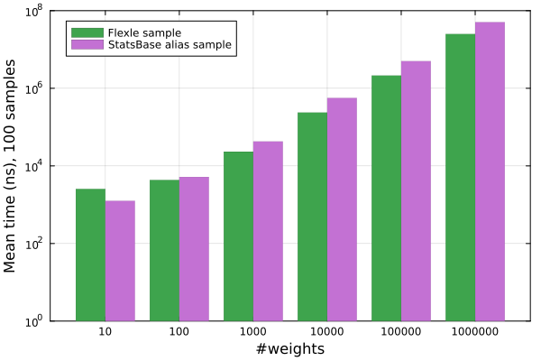
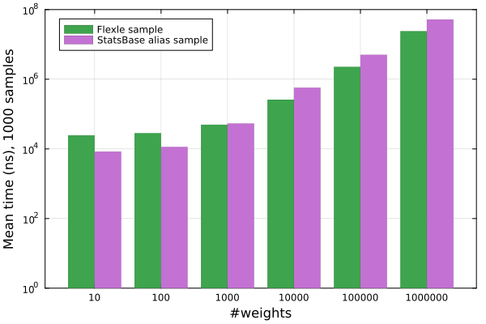
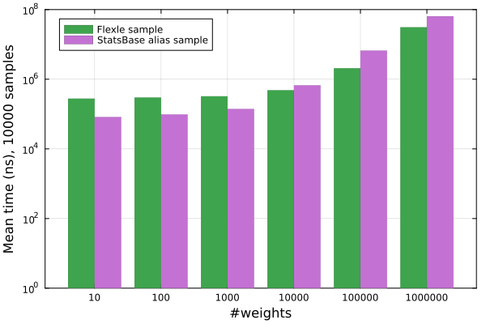

# NOTICE: WORK IN PROGRESS

This benchmarking document is a work in progress. In its current state, it should not be used as a reference
for Flexle performance.

## Benchmarking

Flexle.jl is a performance-focused package. Below are several benchmarks comparing the runtime of various
Flexle operations to their StatsBase.jl equivalents.[^3]

[^3]: See `test/test_runtime.jl` for code used to generate these graphs.

### Sampling

To assess raw sampling performance, we measured time to sample from a random weights vector (weights drawn
from a uniform distribution between 0 and 1) of size $10^k$ for $k \in [1 .. 6]$. Graphs show mean time in nanoseconds to perform a single
sample from a `Weights` vector in the case of StatsBase or a `FlexleSampler` in that of Flexle. These numbers
include only sampling time, excluding time to compute the relevant data structure.

|  |
|:--:|
|*Figure 1: Comparison of raw sample runtime for `Flexle.sample` versus `StatsBase.sample`.* |

For larger weights vectors (i.e. those $\geq 50$ in size), Flexle far outperforms StatsBase in sampling time.
For smaller weights vectors, there is no substantial difference in runtime. Solely in terms of sampling,
the performance benefits of using `Flexle.sample` versus `StatsBase.sample` are generally linear in the number
of weights.

In use cases where the weights vector does not change or when it does so infrequently, other strategies that
involve precomputing a data structure are feasible. The alias method is one such strategy, and it is supported
by StatsBase. To compare performance to the alias method, we measured time to take $10^l$ samples (for
$l \in [2 .. 5]$) from the weights vectors above. These tests include both time to initialize the sampling data
structure (the alias table or flexle sampler, respectively) and to take the specified number of samples.

|     |
|:--:|
|*Figure 2: Comparison of runtime for `Flexle.sample` versus `StatsBase.alias_sample!`, including both sampling and data structure initialization.* |

In this case, the alias method performs better for smaller weights vectors, while Flexle performs better for
larger ones. The dividing line of identical performance depends on the number of samples. As a rough guideline,
when taking $n$ samples from a vector of $m$ weights, one can expect runtime to be best using the alias method
if $n > m$ and Flexle if $n < m$.

### Updating weights

The alias method is not feasible when the weights themselves are frequently changed; there is no way to adjust an
existing alias table without simply regenerating it from scratch, a process which takes $O(m)$ time in the number
of weights.

By contrast, an existing `FlexleSampler` can be adjusted incrementally. Specially, a weight can be:
- updated: $O(1)$ time
- added: $O(1)$ time (amortized)
- removed: $O(m)$ time

To demonstrate this, consider the following sequence of operations that can be implemented using either Flexle
or StatsBase. The sequence is intended to replicate the behavior of performing weighted random samples in practice,
where sampling, updating, addition, and removal of weights all occur in some relative proportion and are interspersed
with other computations; the operations themselves are arbitrary other than to demonstrate runtime performance.

Given a number of iterations $r$ and either a vector of weights or a `FlexleSampler` corresponding to those weights
(either one denoted by $w$):
```
v = w[sample(w)]                  # pick a random element from w and read its weight, v
f = first_decimal_place(v)        # call a function that gets the first number following the decimal point in v

if f==0, delete v from w          # 1/10th of the time, delete an existing element
if f==5, add v/7 to the end of w  # 1/10th of the time, add a new element
else, let v be 2v                 # the remaining 8/10ths of the time, update an existing element

repeat r times
```

The following shows the runtime of (1) initializing a vector of weights and all appropriate data structures, plus
(2) running the above algorithm for random weights vectors as above[^4] for $10^j$ iterations with $j \in [1 .. 4]$.

|     |
|:--:|
|*Figure 3: Comparison of runtime for Flexle versus StatsBase (default sampling algorithm) to perform the aforementioned arbitrary sequence of operations.* |

Flexle's performance benefits are best realized when two conditions are met:
1. The number of operations to be performed (especially sampling, updating, and addition) is large, so the $O(m)$ cost of producing the sampler is successfully amortized.
2. The number of weights is large, so Flexle's sampling is substantially faster than that of alternatives (see [Figure 1](#sampling)).


[^4]: excluding that of size $5$, as too many removals can easily result in an empty weights vector
