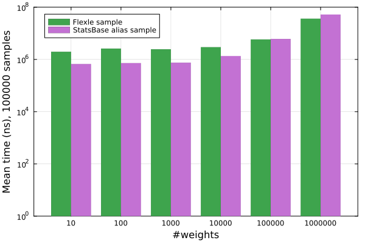

# NOTICE: WORK IN PROGRESS

This benchmarking document is a work in progress. In its current state, it should not be used as a reference
for Flexle performance.

## Benchmarking

Flexle.j is a performance-focused package. Below are several benchmarks comparing the runtime of various
Flexle operations to their StatsBase.jl equivalents.[^3]

[^3]: See `test/test_runtime.jl` for code used to generate these graphs.

### Sampling

To assess raw sampling performance, we measured time to sample from a random weights vector (elements drawn
from $U[0,1)$) of size $5*10^k$ for $k \in [0 .. 5]$. Graphs show mean time in nanoseconds to perform a single
sample from a `Weights` vector in the case of StatsBase or a `FlexleSampler` in that of Flexle. These numbers
include only sampling time, excluding time to compute the relevant data structure.

|  |
|:--:|
|*Figure 1: Comparison of raw sample runtime for* `Flexle.sample` *versus* `StatsBase.sample`. |

For larger weights vectors (i.e. those $\geq 50$ in size), Flexle far outperforms StatsBase in sampling time.
For smaller weights vectors, there is no substantial difference in runtime. Solely in terms of sampling,
the performance benefits of using `Flexle.sample` versus `StatsBase.sample` are generally linear in the number
of weights.

In use cases where the weights vector does not change or when it does so infrequently, other strategies that
involve precomputing a data structure are feasible. The alias method is one such strategy, and it is supported
by StatsBase. To compare performance to the alias method, we measured time to take $10^l$ samples (for
$l \in [2 .. 5]$) from the weights vectors above. These tests include both time to initialize the sampling data
structure and to take the specified number of samples.

|     |
|:--:|
|*Figure 2: Comparison of runtime for `Flexle.sample` *versus* `StatsBase.alias_sample!`*, including both sampling and data structure initialization.* |

In this case, the alias method performs better for smaller weights vectors, while Flexle performs better for
larger ones. The dividing line of identical performance depends on the number of samples. As a rough guideline,
when taking $n$ samples from a vector of $m$ weights, one can expect runtime to be best using the alias method
if $n > 2m$ and Flexle if $n < 2m$.
